# 🧭 Waypoint — Behind the Scenes: How It Was Made

**Find the trail someone already walked.**

Waypoint is a mentor-matching prototype built for the RIT Dubai DesignAthon 2026, as a real case study for the University of West London's Ras Al Khaimah campus (UWL RAK). Tell it your goal, and it finds a student or alum from your own school who already got there — then turns their journey into a mentorship you can actually follow.

This README is the "how it was made" writeup: the problem, the evidence, the design decisions, the tech underneath, and every step of setting it up yourself.

---

## Table of Contents

- [The Problem](#-the-problem)
- [The Evidence](#-the-evidence)
- [Our Own Survey](#-our-own-survey)
- [The Solution](#-the-solution)
- [How It Works](#-how-it-works)
- [Design System](#-design-system)
- [Feature Tour](#-feature-tour)
- [Tech Stack](#-tech-stack)
- [Google Sign-In Setup](#-google-sign-in-setup)
- [Running It Locally](#-running-it-locally)
- [Project Structure](#-project-structure)

---

## 🚧 The Problem

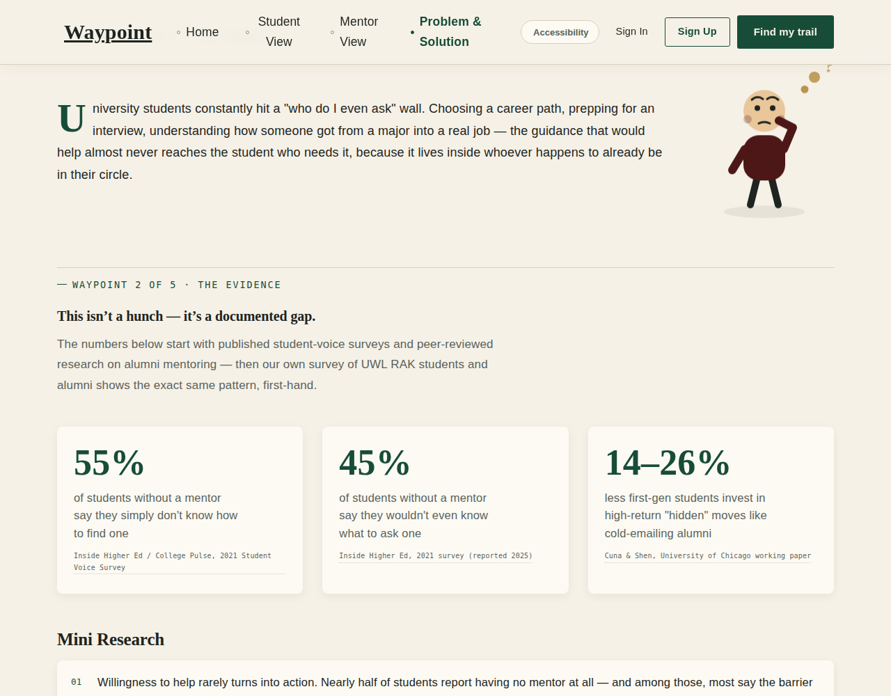

University students constantly hit a "who do I even ask" wall. Choosing a career path, prepping for an interview, understanding how someone got from a major into a real job — the guidance that would help almost never reaches the student who needs it, because it lives inside whoever happens to already be in their circle.

---

## 📊 The Evidence

This isn't a hunch — it's a documented gap, backed by published research before we ever ran our own numbers.

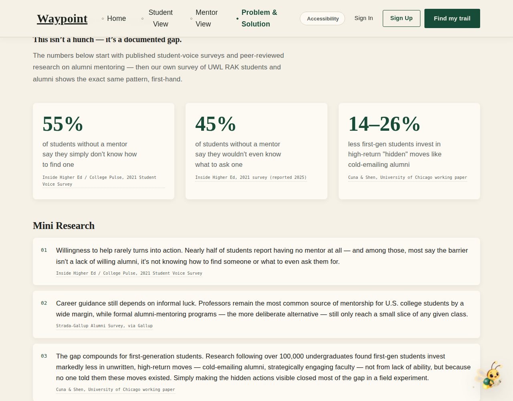

| Stat | Source |
|---|---|
| 55% of students without a mentor simply don't know how to find one | Inside Higher Ed / College Pulse, 2021 Student Voice Survey |
| 45% wouldn't even know what to ask a mentor | Inside Higher Ed, 2021 survey |
| First-gen students invest 14–26% less in high-return "hidden" moves like cold-emailing alumni | Cuna & Shen, University of Chicago working paper |
| Professors remain the most common source of mentorship, by a wide margin — formal alumni-mentoring programs reach only a small slice of any class | Strada-Gallup Alumni Survey, via Gallup |

---

## 📋 Our Own Survey

Two short surveys we ran ourselves, with real UWL RAK students and alumni — because the published research above describes the problem in general, but we wanted the exact same wall confirmed first-hand on the campus this is actually built for.

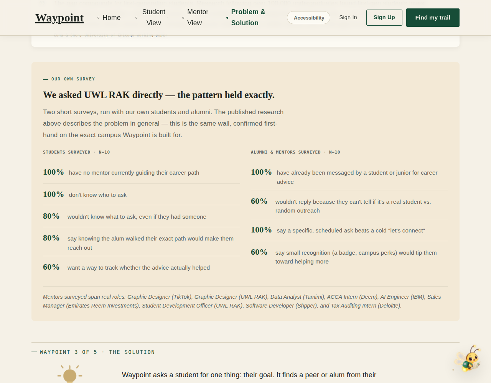

### Students surveyed — n = 10

| Result | Finding |
|---|---|
| **100%** | have no mentor currently guiding their career path |
| **100%** | don't know who to ask |
| **80%** | wouldn't know what to ask, even if they had someone |
| **80%** | say knowing the alum walked their exact path would make them reach out |
| **60%** | want a way to track whether the advice actually helped |

Class mix of respondents: 20% first-year, 10% second-year, 20% third-year, 20% fourth-year, 30% graduate.

### Alumni & mentors surveyed — n = 10

| Result | Finding |
|---|---|
| **100%** | have already been messaged by a student or junior for career advice |
| **60%** | wouldn't reply because they can't tell if it's a real student vs. random outreach |
| **100%** | say a specific, scheduled ask beats a cold "let's connect" |
| **60%** | say small recognition (a badge, campus perks) would tip them toward helping more |

Real roles surveyed: Graphic Designer (TikTok), Graphic Designer (UWL RAK), Data Analyst (Tamimi), ACCA Intern (Deem), AI Engineer (IBM), Sales Manager (Emirates Reem Investments), Student Development Officer (UWL RAK), Software Developer (Shpper), and Tax Auditing Intern (Deloitte).

Between the two surveys, there's primary evidence behind nearly every feature in the product: matching (80% of students), verification (60% of mentors), structured booking (100% of mentors), and outcome tracking (60% of students).

---

## 💡 The Solution

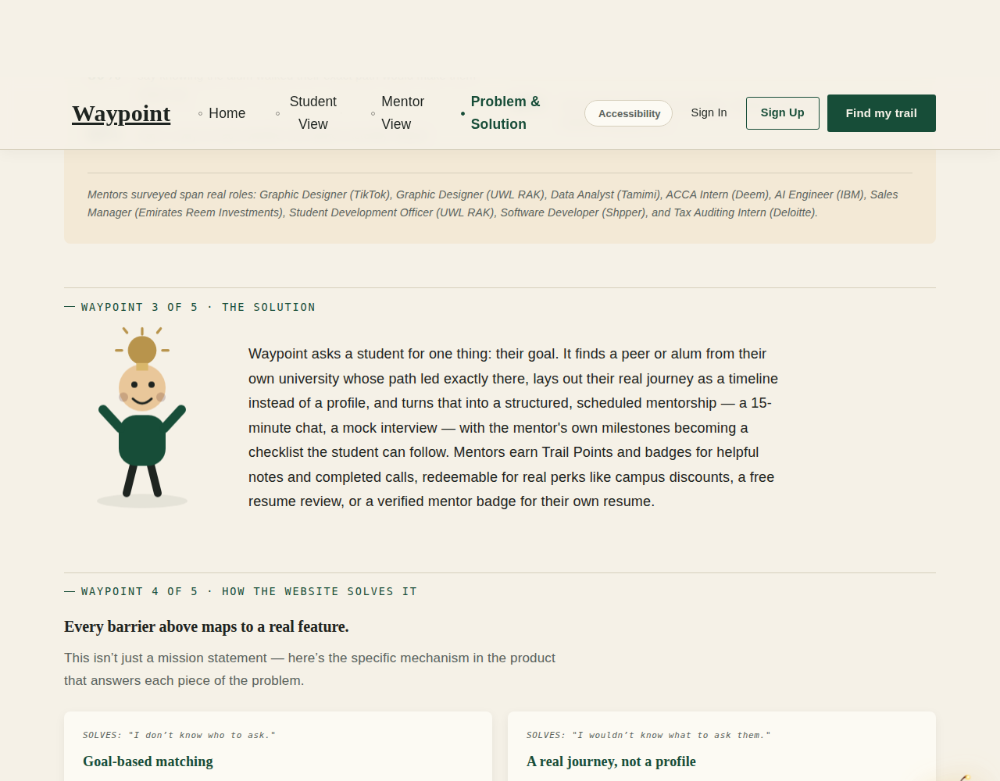

Waypoint asks a student for one thing: their goal. It finds a peer or alum from their own university whose path led exactly there, lays out their real journey as a timeline instead of a profile, and turns that into a structured, scheduled mentorship — a 15-minute chat, a mock interview — with the mentor's own milestones becoming a checklist the student can follow. Mentors earn Trail Points and badges for helpful notes and completed calls, redeemable for real perks like campus discounts, a free resume review, or a verified mentor badge for their own resume.

---

## ⚙️ How It Works

Every barrier from the Problem section maps to a specific mechanism in the product — not just a mission statement.

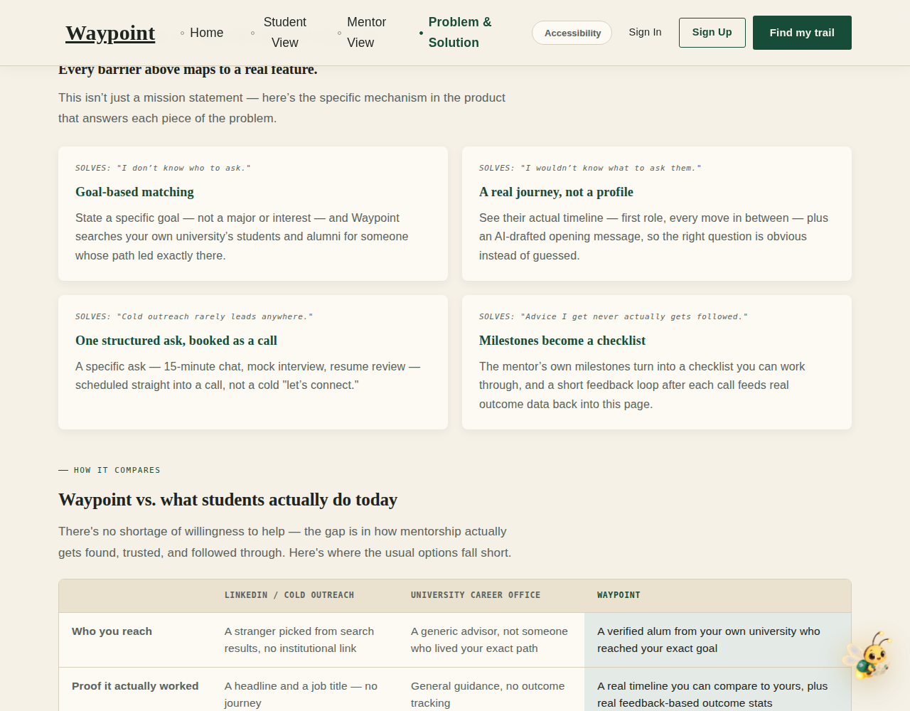

| Problem | Feature |
|---|---|
| "I don't know who to ask." | **Goal-based matching** — state a specific goal, and Waypoint searches your own university's students and alumni for someone whose path led exactly there |
| "I wouldn't know what to ask them." | **A real journey, not a profile** — see their actual timeline plus an AI-drafted opening message |
| "Cold outreach rarely leads anywhere." | **One structured ask, booked as a call** — a specific ask (15-min chat, mock interview, resume review) scheduled straight into a call |
| "Advice I get never actually gets followed." | **Milestones become a checklist** — the mentor's own milestones turn into a checklist, with a feedback loop feeding real outcome data back into the product |

It's also weighed against the alternatives:

| | LinkedIn / cold outreach | University career office | Waypoint |
|---|---|---|---|
| Who you reach | A stranger from search results | A generic advisor | A verified alum from your own school who reached your exact goal |
| Proof it worked | A headline and a job title | General guidance, no tracking | A real timeline plus real feedback-based outcome stats |
| How you ask | A cold DM, low reply rate | Book a generic slot | One structured, weighted-matched ask |

Try it yourself:

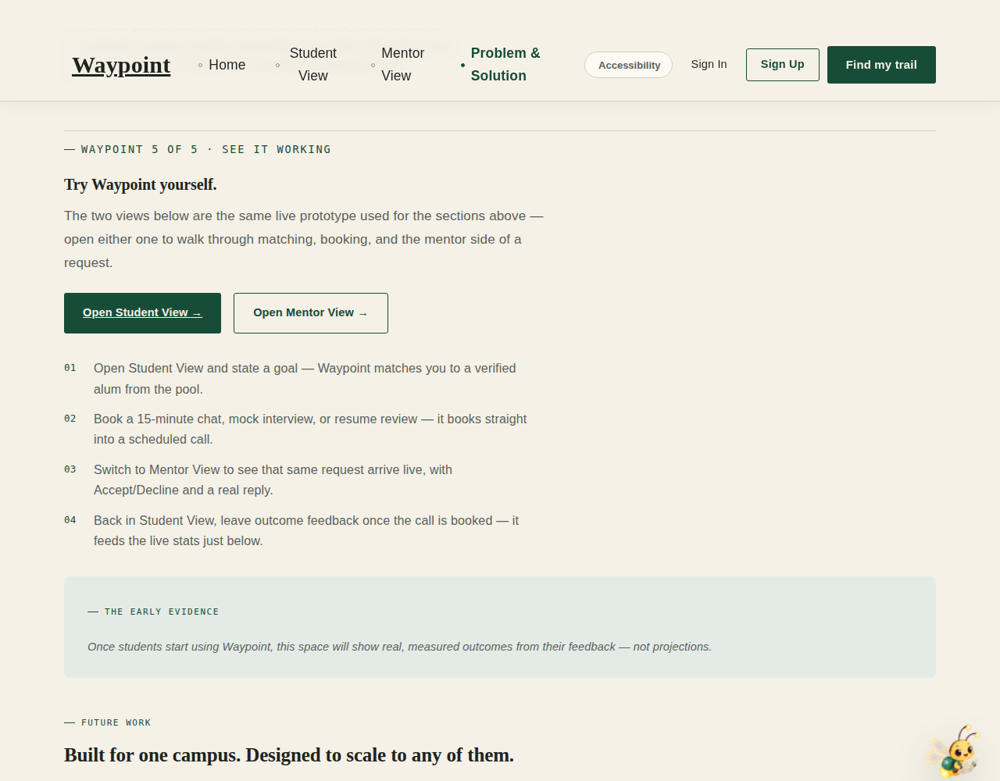

---

## 🎨 Design System

### Colours

Rather than guess at a palette, the direction was shaped by [Figma's Color Combinations resource](https://www.figma.com/resource-library/color-combinations/) — the goal was a disciplined **2 main colours + 1 accent** system instead of a rainbow of competing brand colours (this was also direct feedback from our project advisor).

| Token | Hex | Role |
|---|---|---|
| 🟢 Trail (forest green) | `#174D38` | The single primary brand colour — CTAs, active states, links, headings |
| 🟤 Way (burgundy) | `#4D1717` | Functional only — decline/sign-out/error states, never decorative |
| 🟡 Gold | `#B8934A` | The one restrained accent — rewards, points, badges, achievement moments |
| 🟡 Gold Light | `#F3C86B` | Gold tuned for legibility on dark surfaces (hero, footer) |
| ⚪ Paper (warm ivory) | `#F5F1E7` | The neutral environment — background |
| ⚫ Ink (charcoal) | `#1E2420` | Body text |

Early versions used both trail-green *and* burgundy as competing "primary" colours (burgundy powered ~55 UI elements — eyebrow labels, stat numbers, several CTA buttons). It was consolidated down to a single primary, with burgundy demoted to exclusively signal negative/error states — which is what actually satisfies the "2 main colours + 1 accent" principle.

### Typography

Font pairing leaned on [Canva's guide to franchise/brand fonts](https://www.canva.com/learn/franchise-fonts/) for how to combine an editorial serif display face with a clean, quiet body font.

| Typeface | Used for |
|---|---|
| **Abhaya Libre** (serif) | Headings, editorial display text — the "field guide" voice |
| **Jost** (sans-serif) | Body copy, navigation, buttons, UI |
| **IBM Plex Mono** | Labels, metadata, mile-markers, small technical details |
| **Amiri** (serif) + **Tajawal** (sans) | Arabic equivalents for the fully bilingual, RTL-aware version of the site |

A consistent H1 → H2 → H3 → H4 → body → metadata hierarchy runs through every page — including fixing a real bug along the way where a few `<h3>`/`<h4>` tags had no defined style and silently fell back to the browser default font instead of the serif system.

---

## 📱 Feature Tour

### Home
Cinematic video hero, the WHAT/WHO/WHY quick-answer strip, and the goal input that starts the whole flow in one motion.

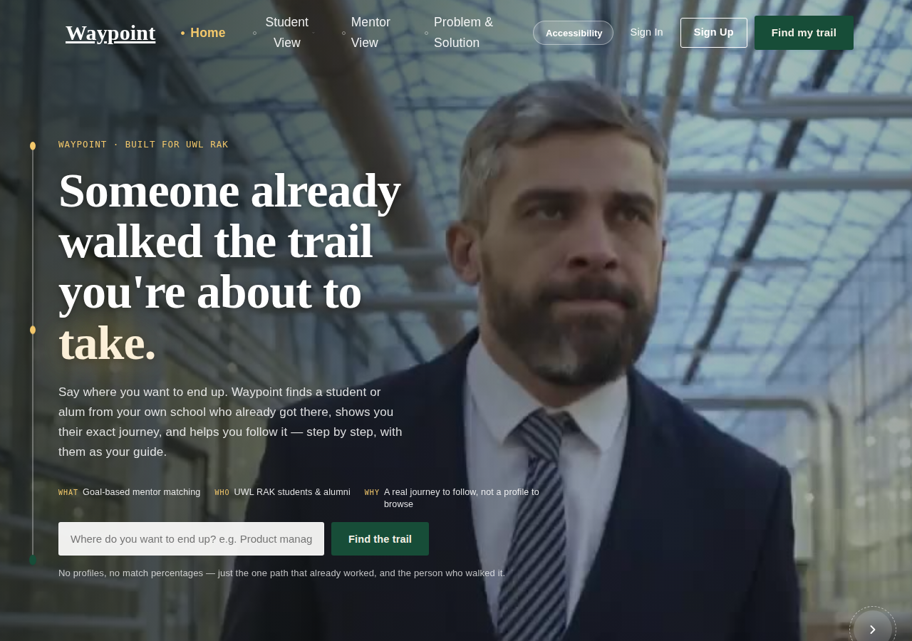

### Finding a Mentor — Student View
Goal, major, year, shared-experience tags (optional, private — used only for matching, never shown publicly), and preferred communication style feed a real weighted-matching algorithm.

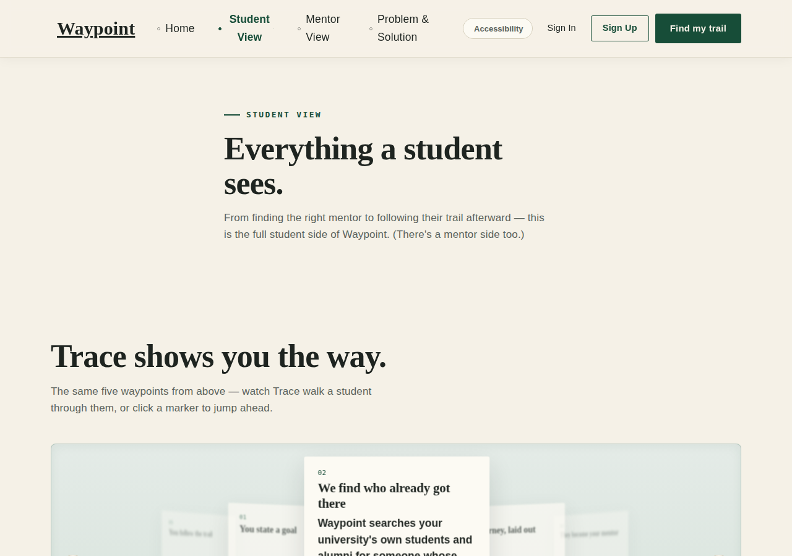

### The Match Reveal
Leads immediately with **why this person** — name, major, class year, "Why matched," and "Can help with" — before the deeper score breakdown, trust badges, and career timeline underneath.

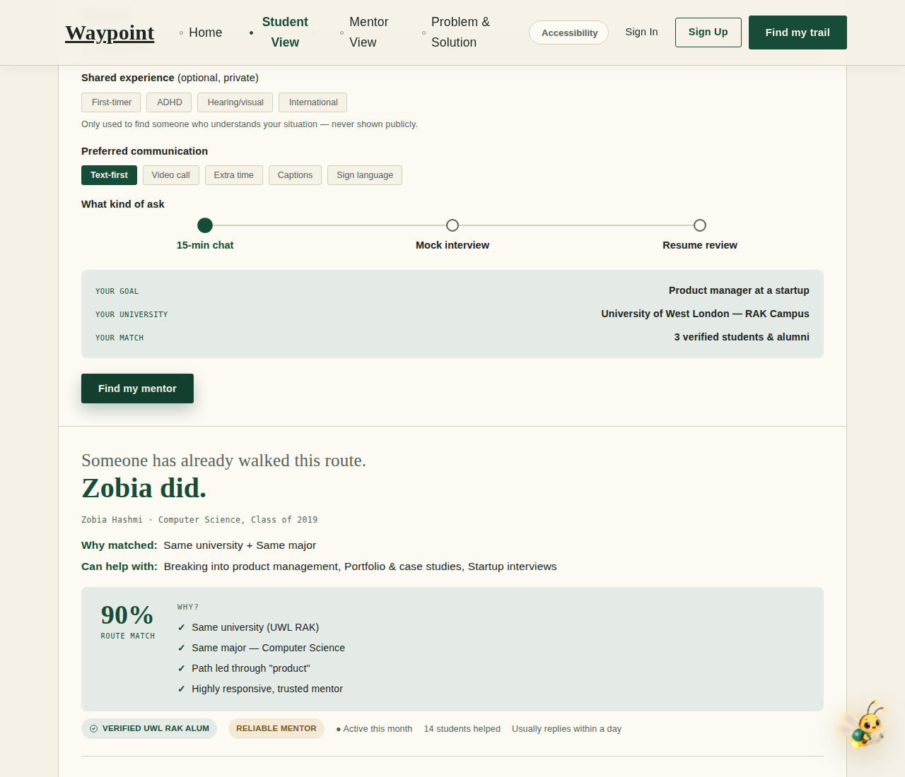

### Trail Notes
Real, specific advice left by past mentors — filterable by shared experience (first-gen, disability, international) — not generic platitudes.

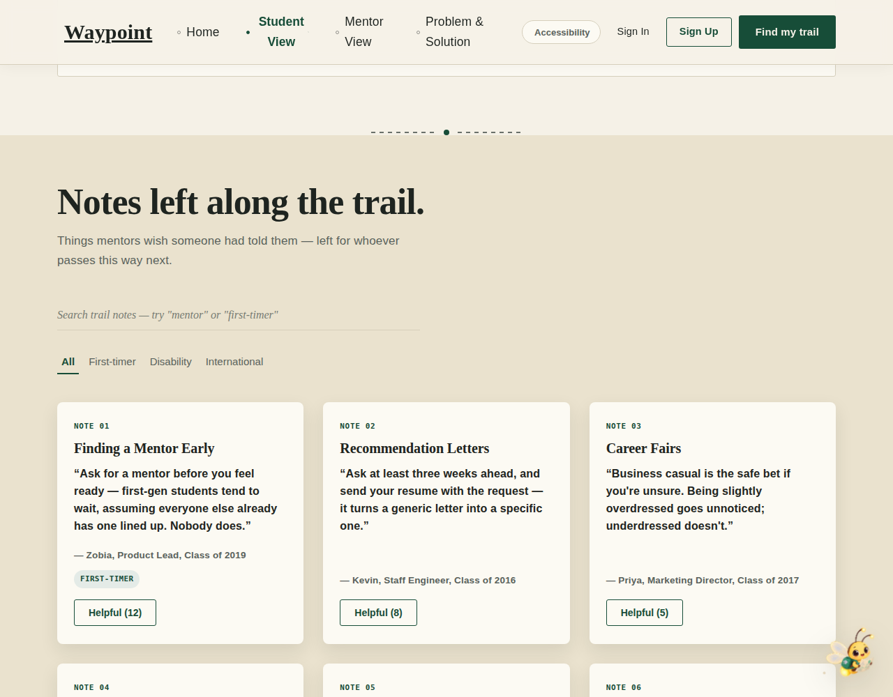

### Mentor View
The other side of every request — Accept/Decline, Trail Points, reward badges, and a redeem catalog for real perks.

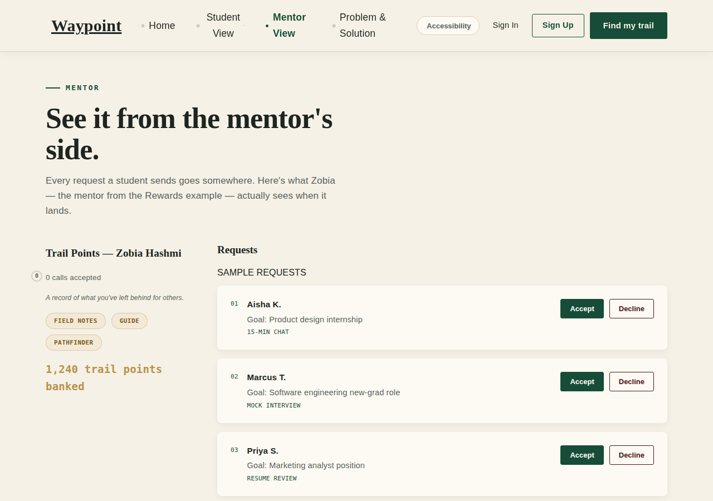

### Sign In / Sign Up
Consistent, minimal auth with a show/hide password toggle and a fully working "Continue with Google."

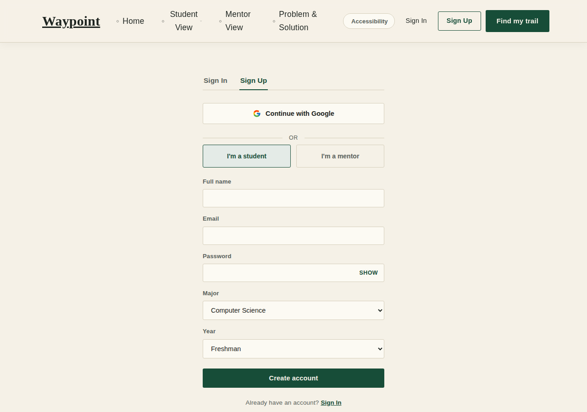

### Mobile
Fully responsive — the whole matching flow, trail notes grid, and navigation collapse cleanly down to a single column.

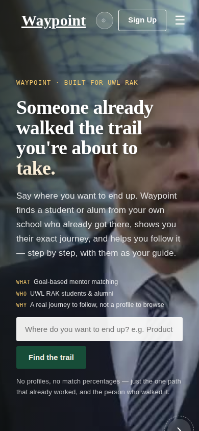

---

## 🛠 Tech Stack

| Layer | Choice |
|---|---|
| Framework | React 18 (function components + hooks) |
| Build tool | Vite |
| Routing | `react-router-dom` (`HashRouter`, so it deploys anywhere with zero server config) |
| Styling | Plain CSS with custom properties (design tokens) — no CSS framework, no Tailwind |
| State / persistence | React state + Context (`AuthContext`, `SiteContext`) backed by `localStorage` — no backend server |
| Live AI matching | Anthropic's Claude API (`claude-sonnet-4-6`), called directly from the browser, with a genuine weighted-scoring algorithm as an offline fallback (same major, goal-keyword overlap, shared experience, mentor responsiveness/trust) so the demo works identically whether or not the live API call succeeds |
| Authentication | Local email/password auth, plus real **Google Identity Services** OAuth (see below) |
| Internationalisation | Custom `i18n` layer — full English + Arabic translations, with RTL layout support |
| Deployment | Static build (`npm run build`) — deployed on Vercel |
| Fonts | Google Fonts (Abhaya Libre, Jost, IBM Plex Mono, Amiri, Tajawal) |
| Icons/mascot | Hand-built inline SVG illustrations + a custom-designed mascot ("Trace") |

No backend server, no database — this is a fully static, client-side app. All accounts, requests, and reward points live in the browser's `localStorage`.

---

## 🔐 Google Sign-In Setup

"Continue with Google" uses **real Google Identity Services** — not a fake demo login. Whoever clicks it authenticates on Google's own real popup and lands on their own respective account. Since this is a static frontend with no backend, it needs a **Google OAuth Client ID** registered to your own domain. Here's the exact path we took:

1. **Create a Google Cloud project** at [console.cloud.google.com](https://console.cloud.google.com) — click the project dropdown → New Project → name it (e.g. "Waypoint") → Create. Make sure "No organization" is fine if that's your only option (personal Gmail accounts don't have one).

2. **Set up the OAuth consent screen** — go to *APIs & Services → OAuth consent screen* (or search "Google Auth Platform") → **Get started**. Fill in:
   - App name: `Waypoint`
   - User support email: your email
   - Audience: **External**
   - Developer contact email: your email again

3. **Fill in the Branding page** (required before you can publish later) — under the same section, go to **Branding**:
   - App name, support email (already set)
   - **Application home page** → your deployed URL
   - **Application privacy policy link** → required to publish — if you don't have a real one, your deployed site's homepage URL works fine for a prototype
   - **Authorized domain** → your bare domain, e.g. `your-app.vercel.app` (no `https://`, no trailing slash)
   - Save

4. **Create the OAuth Client ID** — go to **Credentials → + Create Credentials → OAuth client ID**:
   - Application type: **Web application**
   - **Authorized JavaScript origins** → add every URL you'll run the site from, e.g. `http://localhost:5173` for local dev and your real deployed URL (no trailing slash on either) — you can list more than one
   - Click Create — Google immediately shows you the Client ID

5. **Drop the Client ID into the code** — open `src/pages/AuthPage.jsx` and replace the placeholder:
   ```js
   const GOOGLE_CLIENT_ID = 'YOUR_GOOGLE_CLIENT_ID.apps.googleusercontent.com';
   ```

6. **Publish the app** so anyone (not just test users) can sign in — go to **Audience** → **Publish app**. While in "Testing" mode, only Google accounts explicitly added under "Test users" can sign in (capped at 100). Publishing removes that cap. Since this only requests basic profile/email scopes, no lengthy Google verification review is required.

   > First-time visitors will briefly see a "Google hasn't verified this app" screen before signing in — that's expected for an unverified small project and doesn't block anyone; they click "Advanced → Go to Waypoint (unsafe)" and proceed normally.

**A couple of real gotchas we hit along the way**, in case they save you time:
- Google's Authorized JavaScript Origins field rejects any URL with a trailing `/` — `https://your-app.vercel.app/` fails, `https://your-app.vercel.app` works.
- "Publish app" will stay greyed out with a vague "complete your Branding page" message until *every* required Branding field is filled — the privacy policy link is easy to miss since it's not marked as obviously required as the others.
- If Cloud Console throws a confusing permissions/IAM error on an auto-generated project name you didn't choose, you're probably looking at the wrong project (or the wrong signed-in Google account) — check the project switcher at the top of the console.

Once configured, the flow is genuinely real: clicking the button opens Google's actual account picker (`prompt: 'select_account'` forces it to always ask, rather than silently reusing a cached session), fetches the signer's real name and email, and either signs them into their existing Waypoint account or creates a new one under their real identity.

---

## 🚀 Running It Locally

```bash
npm install
npm run dev
```

Open the local URL Vite prints (usually `http://localhost:5173`).

### Build for production

```bash
npm run build
npm run preview
```

---

## 📁 Project Structure

```
src/
  components/     Shared UI: Nav, Footer, MentorMatch, TrailNotes, Rewards, SiteTour, Trace...
  pages/          Route-level pages: HomePage, FeaturesPage, MentorPage, ProblemSolutionPage, AuthPage
  context/        SiteContext (language/theme/tour), AuthContext (local auth)
  data/           alumni.js (mentor pool), requestsStore.js (localStorage-backed request/feedback data)
  i18n/           translations.js — full English + Arabic copy
  App.css         The entire design system: tokens, typography, components
docs/
  screenshots/    Every image used in this README
```

---

*Waypoint — DesignAthon 2026 prototype, built as a case study for University of West London, Ras Al Khaimah campus. Mentor and journey data shown in the demo is illustrative.*
